# Orchestrator C4 diagram

This C4-style component diagram shows the interactive orchestration boundary, planning-stage design fleet, selective cross-vendor judge, engineering fleet, and deterministic completion gates. Solid arrows carry control or evidence; dashed arrows indicate a skill loaded by an agent.

## Mermaid source

Use Markdown Preview (`Ctrl+Shift+V`) to render the current diagram. The source is retained directly in this document so the fleet topology stays reviewable with the agent and contract configuration.

```mermaid
flowchart TB
    user["Person<br/>User"]

    subgraph system["System: Claude Code Orchestrator"]
        direction TB
        orchestrator["Container: Orchestrator<br/>classifies, asks for approval,<br/>routes jobs and reports results"]

        subgraph planning["Container: Plan-first route"]
            direction LR
            planner["Component: Planner<br/>read-only plan design"]
            researcher["Component: Researcher<br/>evidence collection"]
            scribe["Component: Scribe<br/>approved plans and documents"]
        end

        subgraph design["Container: Planning-stage design fleet"]
            direction LR
            designGeneralist["Component: Design Generalist<br/>Compact Sonnet specification"]
            designDirector["Component: Design Director<br/>Standard/Studio synthesis"]
            ux["Component: UX Architect"]
            visual["Component: Visual System Designer"]
            designReviewer["Component: Design Reviewer<br/>independent gate"]
            prototyper["Component: Design Prototyper<br/>one guarded Studio artifact"]
        end

        judge["Component: Codex Judge Runner<br/>Haiku transport-only"]

        subgraph execution["Container: Tiered engineering and completion gates"]
            direction LR
            engineeringLead["Component: Engineering Lead<br/>read-only route and handoff coordinator"]
            t1["Component: T1 Engineer<br/>Haiku first-line code/tests"]
            t2["Component: T2 Engineer<br/>Sonnet escalation code/tests"]
            t3["Component: T3 Advisor<br/>Opus read-only guidance"]
            verifier["Component: Verifier<br/>independent diff and test gate"]
            browser["Component: Browser Validator<br/>visual UI/webview gate"]
        end

        subgraph skills["Components: scoped skills"]
            direction LR
            plannerSkills["planner-core<br/>repository analysis<br/>spec decomposition<br/>risk validation"]
            researchSkills["researcher-core<br/>architecture/comparison<br/>source audit/browser UI"]
            scribeSkills["scribe-core<br/>planning/technical docs<br/>editorial quality"]
            t1Skills["t1-core<br/>TDD/route tracing<br/>UI/security/reliability"]
            verifierSkill["verifier-core"]
            browserSkill["browser-validator-core"]
        end
    end

    repo["External system: Target repository<br/>source, tests, approved plan"]
    chrome["External system: Claude in Chrome<br/>visible browser and DevTools"]
    playwright["External system: Playwright Chromium<br/>existing setup or approval-gated fallback"]
    codex["External system: local Codex CLI<br/>ephemeral, read-only, web/MCP off"]

    user -->|request or approval| orchestrator
    orchestrator -->|non-basic PLAN_JOB| planner
    planner -->|material research| researcher
    researcher -->|RESEARCH_EVIDENCE| planner
    planner -->|Compact DESIGN_JOB| designGeneralist
    planner -->|Standard/Studio DESIGN_JOB| designDirector
    designDirector -->|selected direction| ux
    designDirector -->|selected direction| visual
    planner -->|independent review| designReviewer
    planner -->|selected Studio only| prototyper
    planner -->|PLANNING_HANDOFF| scribe
    scribe -->|approved plan path| orchestrator
    orchestrator -->|selective JUDGE_JOB checkpoints| judge
    judge -->|guarded stdin invocation| codex
    codex -->|schema result + usage| judge
    orchestrator -->|route / approved job| engineeringLead
    engineeringLead -->|standard ENGINEERING_JOB| t1
    engineeringLead -->|extreme advisory checkpoints| t3
    t3 -->|T2 escalation recommendation| engineeringLead
    engineeringLead -->|WRITER_RELEASED request| t1
    orchestrator -->|escalation packet after release| t2
    t1 -->|JOB_DONE claim| orchestrator
    t2 -->|JOB_DONE claim| orchestrator
    orchestrator -->|VERIFICATION_JOB| verifier
    verifier -->|VERIFICATION_PASS| orchestrator
    verifier -->|NEEDS_FIX / BLOCKED| orchestrator
    orchestrator -->|bounded remediation, max 2| t1
    orchestrator -->|bounded remediation, max 2| t2
    orchestrator -->|BROWSER_VALIDATION_JOB<br/>UI/webview only| browser
    browser -->|BROWSER_PASS / NOT_APPLICABLE| orchestrator
    browser -->|NEEDS_FIX / BLOCKED| orchestrator
    orchestrator -->|verified outcome| user

    planner -. loads .-> plannerSkills
    researcher -. loads .-> researchSkills
    scribe -. loads .-> scribeSkills
    t1 -. loads .-> t1Skills
    verifier -. loads .-> verifierSkill
    browser -. loads .-> browserSkill

    planner -->|read-only inspection| repo
    t1 -->|edits and tests| repo
    verifier -->|independent checks| repo
    browser -->|launch/reset and evidence| repo
    browser -->|preferred backend| chrome
    browser -->|fallback backend| playwright
    orchestrator -->|one-time approval when missing| user
```

## Completion rule

`JOB_DONE` from either writer is not a final result. The orchestrator reports engineering completion only after `VERIFICATION_PASS` and, for browser-rendered UI/webview work, `BROWSER_PASS`. A non-UI job must produce `BROWSER_NOT_APPLICABLE` explicitly. Two counted T1 gate failures create an evidence-backed T2 escalation; T2 has the same two-cycle cap. T3 advises but never writes or approves. An unresolved prerequisite remains blocked rather than counting as remediation.

## Browser fallback

Browser Validator uses Claude in Chrome first, then an existing Playwright setup. When neither is available it returns `BROWSER_BLOCKED` with `playwright_missing`; the orchestrator asks the user once before allowing the pinned `npx --yes playwright@1.61.0 install chromium` bootstrap. The fallback uses npm/Playwright user caches and must not change the target repository's dependency manifest, lockfile, or source tree.
